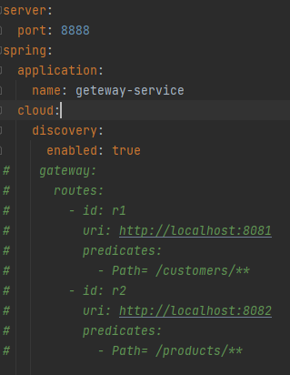
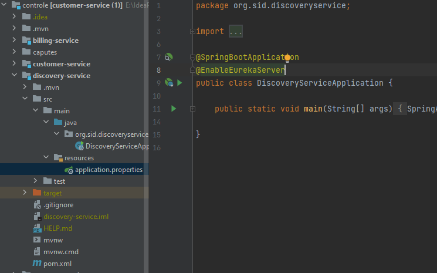
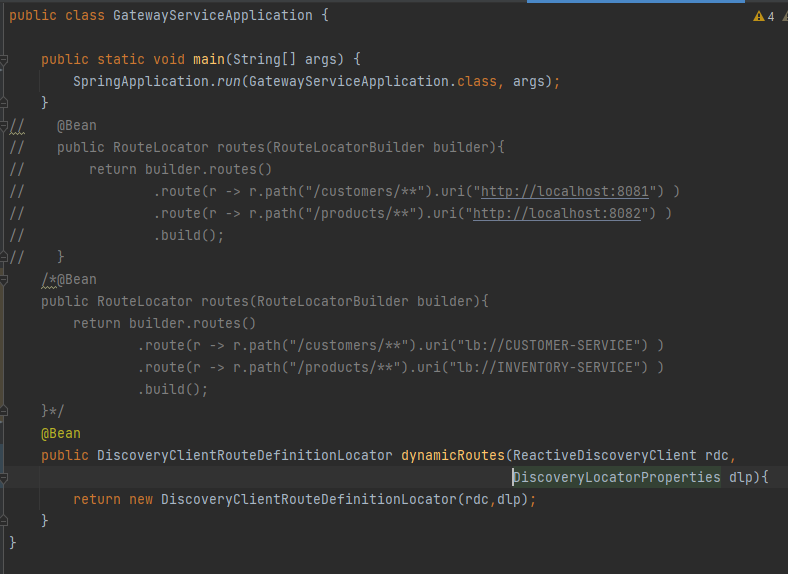
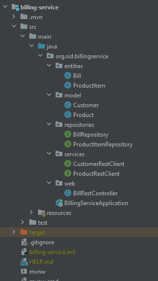

<h3> Compte rendu </h3>

<h5> 1.micro-service customer-service</h5>

<h5> 2.micro-service inventory-service</h5>

<h5> 3.la Gateway Spring cloud Gateway</h5>

<h5> 4.Configuration statique du système de routage</h5>

<h5> 5.l'annuaire Eureka Discrovery Service</h5>

<h5> 6.configuration dynamique des routes de la gateway</h5>

<h5> 7.le service de facturation Billing-Service </h5>

